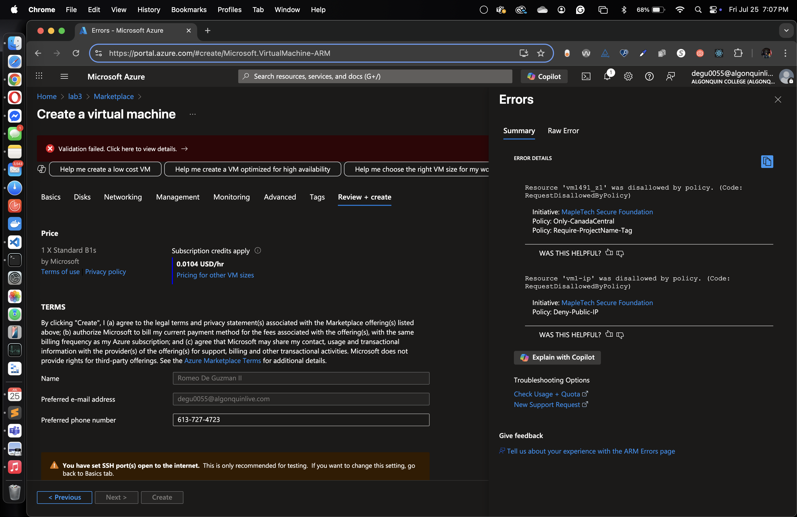
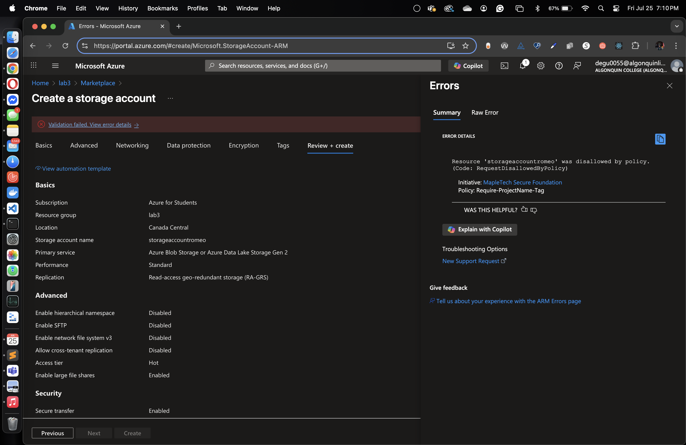
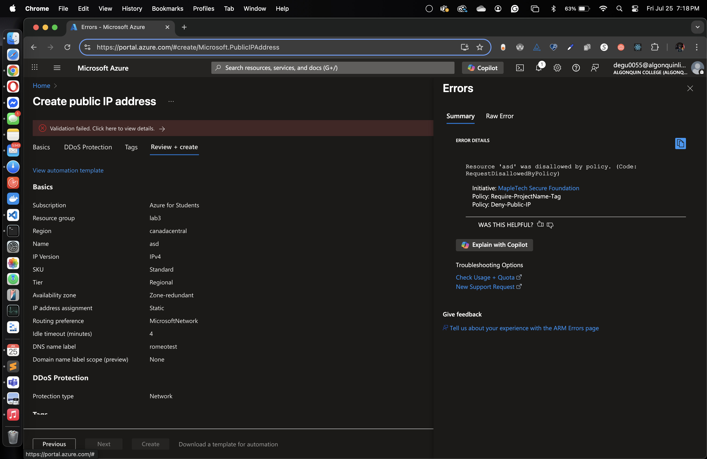

# Azure Policy Lab - MapleTech Solutions

## Summary

This lab is about making sure all resources follow company rules in Azure.  
I created 3 custom policies:  
1. Allow resources only in Canada Central region.  
2. Require all resources to have a tag called `ProjectName`.  
3. Block creation of Public IP addresses.  

I put these policies together into one initiative called **MapleTech Secure Foundation**.  
Then I assigned it to a resource group to enforce these rules.

## Explanation of Each Policy

- **Only-CanadaCentral**: Denies resources deployed outside Canada Central.  
- **Require-ProjectName-Tag**: Denies resources that do not have the `ProjectName` tag.  
- **Deny-Public-IP**: Denies creation of any Public IP address resource.

## Test Results

I tried to deploy some resources to check if the policies work:

- Deploy VM in East US (not allowed)  
  

- Deploy Storage Account without ProjectName tag (not allowed)  
  

- Create Public IP address (not allowed)  
  

## Challenges and Lessons Learned

- Writing the policy JSON needs careful structure.  
- Testing helped to understand how Azure Policy blocks resources.  
- Tagging is very important for resource organization and compliance.  

---

## Video Demo Link

[Watch demo video here](YOUR_VIDEO_LINK_HERE)

